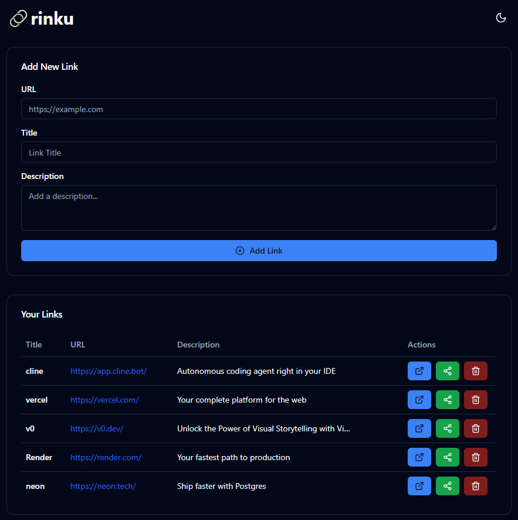

# 🔗rinku (mean link in japanese)
- A tool to collect and sharing links.

- Build with [nodejs](https://nodejs.org/) and [react](https://react.dev/).

- Tried vibe coding with [v0](https://v0.dev/) and [cline](https://app.cline.bot/).

- Postgres database with [neon](https://neon.tech/) and serve by [vercel](https://vercel.com/) for frontend and [render](https://render.com/) for backend.

